# MatchDay Hub: Master Architecture, Multi-Portal Workflow & FotMob Design System

Dokumen ini merupakan **Cetak Biru Arsitektur (Master Architecture Blueprint)** resmi untuk platform **MatchDay Hub**. Dokumen ini mengintegrasikan:
1. **Design System Modern berbasis FotMob** (*Light, high-contrast, clean sports UI*).
2. **Arsitektur 5 Portal Mandiri Terpisah** (*Futscore.id dedicated portal model*).
3. **Fitur Integritas Lapangan**: Digital Player Pass (QR Code), PWA Offline-First Scoring, dan Smart Disciplinary Engine.
4. **Fitur Media & Penyiaran**: 1-Click Social Media Graphics Generator, OBS Live Streaming Overlay, dan Automated Player Rating (1.0–10.0).
5. **Ekosistem Bisnis & Komunikasi**: WhatsApp Notification Bot, Integrasi Pembayaran QRIS/VA, dan Sponsorship Placement Engine.

---

## 1. FotMob Design System Specification

```yaml
design_system:
  name: FotMob Design Tokens
  colors:
    background: "#f5f5f5"      # Latar belakang aplikasi abu-abu terang bersih
    surface: "#ffffff"         # Latar belakang card, tabel & modal putih bersih
    text: "#222222"            # Teks utama charcoal tajam & kontras
    text_muted: "#666666"      # Teks sekunder / label metrik
    border: "#f0f0f0"          # Garis pemisah halus (subtle border)
    primary: "#222222"         # Aksen utama & tombol aksi dominan
    on_primary: "#ffffff"      # Teks di atas warna primary
    accent_live: "#d71149"     # Aksen status LIVE, kartu merah & warning foul 5
    accent_foul: "#eab308"     # Aksen foul 1-4 & kartu kuning
    accent_green: "#0a8a4a"    # Aksen kemenangan, verifikasi lolos & clean sheet

  typography:
    display:
      fontSize: "25px"
      fontWeight: 500
      lineHeight: "1.28"
    heading:
      fontSize: "19px"
      fontWeight: 700
      lineHeight: "1.2"
    body:
      fontSize: "14px"
      fontWeight: 400
      lineHeight: "1.4"

  spacing:
    base: "4px"
    scale: [8, 12, 16, 24, 40, 44]

  radius:
    sm: "4px"                  # Badge kecil, tag status & dot indicator
    md: "14px"                 # Input field, tombol & dropdown
    lg: "16px"                 # Card pertandingan, scoreboard banner
    xl: "22px"                 # Container utama, modal & floating navigation

  breakpoints:
    mobile: "769px"
    tablet: "992px"
    desktop: "1120px"
    wide: "1280px"
    ultrawide: "1632px"
```

---

## 2. Arsitektur 5 Portal Terdedikasi & Ekosistem Terintegrasi

MatchDay Hub memisahkan seluruh alur kerja operasional ke dalam **5 Portal Mandiri** yang beroperasi di atas satu *Core Data Engine*:

```mermaid
graph TD
    %% Core Engine
    subgraph CoreEngine [DATABASE, CACHE & INTEGRATION ENGINE]
        DB[(PostgreSQL / Prisma)]
        Redis[(Redis Cache & Live Pub/Sub)]
        S3Storage[(S3 Storage: PDF BAP, Poster & Foto)]
        DisciplinaryEngine[Smart Disciplinary & Suspension Engine]
        PaymentGateway[Payment Gateway: QRIS / Midtrans]
        WABot[WhatsApp Notification Gateway]
    end

    %% Auth Gateway
    Auth[Single Sign-On: Google OAuth 2.0 & Email/Password] --> RoleRouter{Role Router / Dispatcher}

    %% Portal 1: Public Fan & Media
    RoleRouter -- Fans, Penonton & Media --> P1[PORTAL 1: PUBLIC MATCH CENTER & FOTMOB LIVE]
    P1 --> P1_1[Livescore Strip Carousel & Match Hub]
    P1 --> P1_2[Live Match Center: Pitch 2D, Timeline & Stats]
    P1 --> P1_3[Klasemen Real-time & Top Scorer]
    P1 --> P1_4[1-Click Download PDF BAP & Press Kit]
    P1 --> P1_5[Automated Player Rating 1.0-10.0 & MOTM]

    %% Portal 2: Club & Squad Management
    RoleRouter -- Admin Club, Pelatih & Atlet --> P2[PORTAL 2: CLUB & SQUAD MANAGEMENT]
    P2 --> P2_1[Registrasi Tim & Pembayaran Biaya via QRIS]
    P2 --> P2_2[Roster Pemain & Upload Screening KTP/NISN]
    P2 --> P2_3[Digital Player Pass Ber-QR Code]
    P2 --> P2_4[Lineup Builder: Auto-Lock Jika Terkena Sanksi]

    %% Portal 3: Tournament Organizer
    RoleRouter -- Super Admin & Panitia Event --> P3[PORTAL 3: ORGANIZER & EVENT ADMIN]
    P3 --> P3_1[Master Turnamen: Futsal & Football]
    P3 --> P3_2[Generator Bagan Grup / Knockout & Jadwal]
    P3 --> P3_3[Panel Screening & Verifikasi Berkas Pemain]
    P3 --> P3_4[Sponsorship Placement Engine]
    P3 --> P3_5[1-Click Social Media Graphics Generator]

    %% Portal 4: Match Operator & Live Scoring
    RoleRouter -- Wasit Meja & Operator Lapangan --> P4[PORTAL 4: OPERATOR MEJA & LIVE SCORING]
    P4 --> P4_1[Tablet E-Scoreboard Ramah Sentuhan]
    P4 --> P4_2[PWA Offline-First Mode & Auto Sync]
    P4 --> P4_3[Keypad Cepat: Gol, Kartu, Timeout & Timer]
    P4 --> P4_4[Foul Counter 5-Dot & 10m Penalty Alert]
    P4 --> P4_5[OBS / vMix Transparent Live Overlay]

    %% Portal 5: Match Commissioner & Officials
    RoleRouter -- Pengawas Laga & Penilai Wasit --> P5[PORTAL 5: COMMISSIONER & OFFICIALS]
    P5 --> P5_1[QR-Code Scanner Screening Pemain di Lapangan]
    P5 --> P5_2[Otorisasi DSP Resmi Pra-Laga]
    P5 --> P5_3[Digital E-Signature Pengesahan BAP]
    P5 --> P5_4[Lembar Penilaian Kinerja Wasit Assessor]

    %% Integrations
    P2 <--> PaymentGateway
    P4 <--> Redis
    P4 <--> DB
    P5 --> DisciplinaryEngine
    P5 --> WABot
    P5 <--> S3Storage
```



---

## 3. Fitur Unggulan Nilai Tambah (*High-Impact Features*)

---

### 🛡️ 1. Integritas Lapangan & Anti-Kecurangan

#### A. Digital Player Pass & Scan QR Screening (Anti-Joki)
* **ID Atlet Digital**: Setiap atlet yang lolos verifikasi berkas memiliki kartu identitas digital dengan foto profil ber-watermark federasi dan QR-Code terenkripsi.
* **Alur Validasi di Lapangan**:
  1. H-20 menit sebelum kick-off, Match Commissioner membuka pemindai QR di Portal Pengawas (`/officials/scan-player`).
  2. Mengarahkan kamera tablet/HP ke QR-Code kartu atlet.
  3. Layar langsung memvalidasi keaslian data, foto wajah asli, status nomor punggung, dan izin bermain.

#### B. PWA Offline-First Scoring Mode (Anti-Blank Sinyal GOR)
* **Teknologi**: Menggunakan *Service Worker* dan *IndexedDB* lokal.
* **Mekanisme Kerja**:
  1. Operator meja tetap dapat mencatat gol, kartu, foul, timeout, dan stopwatch waktu secara mulus meskipun koneksi internet di dalam GOR futsal terputus total.
  2. Data tersimpan dalam antrean lokal (*offline transaction queue*).
  3. Saat koneksi terhubung kembali, sistem secara otomatis melakukan *batch upload sync* ke database PostgreSQL dan menyebarkan status terkini via Redis.

#### C. Smart Disciplinary & Card Suspension Engine
* **Pencegahan Human Error**:
  - Jika seorang pemain mendapatkan **Kartu Merah Langsung** atau **Akumulasi 2 Kartu Kuning** di 2 laga berbeda pada fase grup, *Disciplinary Engine* otomatis menandai status pemain sebagai `SUSPENDED` untuk laga berikutnya.
  - Pada Portal Klub (*Lineup Builder*), nama pemain yang disanksi akan terkunci (*disabled*) dengan label merah: `TERKENA SANKSI AKUMULASI KARTU - TIDAK DAPAT DIMAINKAN`.

---

### 🎨 2. Fitur Media, Penyiaran & Branding

#### A. 1-Click Social Media Match Graphics Generator (Instagram Feed & Story)
* **Otomasi Grafis Publikasi**: Menggunakan engine rendering gambar instan berbasis `@vercel/og` / *HTML5 Canvas* untuk menghasilkan aset media visual HD dalam 1-klik:
  1. **Starting Lineup Graphic**: Formasi 5 pemain futsal / 11 pemain bola lengkap dengan nama, nomor punggung, dan logo klub.
  2. **Full-Time Score Card**: Rangkuman skor akhir, logo kedua tim, pencetak gol, serta logo sponsor turnamen.
  3. **Tournament Bracket Poster**: Bagan perjalanan tim dari perempat final menuju juara.

```
+-------------------------------------------------------------+
|               🏆 LIGA FUTSAL INDONESIA 2026                 |
|                                                             |
|         BLACK STEEL FC       vs       BINTANG TIMUR         |
|              ( 5 )                        ( 3 )             |
|                                                             |
|  ⚽ Evan Soumilena 11', 28'         ⚽ Singgih Romana 14'   |
|  ⚽ Holypaul Septinus 19' (P)       ⚽ Ardiansyah Runtuboy  |
|  ⚽ Wendy Brian 38'                                         |
|                                                             |
|             [ OFFICIAL FINAL MATCH REPORT ]                 |
|        Presented by: Bank Mandiri  |  Specs Indonesia       |
+-------------------------------------------------------------+
```

#### B. OBS Studio & vMix Live Stream Overlay (Broadcast Package)
* **Rute Khusus**: `/overlay/match/[matchId]/scoreboard` (latar belakang transparan *Alpha Channel*).
* **Integrasi Siaran YouTube / TikTok Live**:
  - Panitia siaran menambahkan URL tersebut sebagai *Browser Source* di OBS Studio atau vMix.
  - Papan skor pada tayangan video live streaming akan berganti otomatis (skor, timer menit/detik, kartu kuning/merah, dan akumulasi foul) seketika saat operator meja menekan tombol di tablet tanpa intervensi manual tim broadcaster.

#### C. FotMob Automated Player Rating & Man of the Match (MOTM)
* **Algoritma Performa Pemain (Skala 1.0 – 10.0)**:
  - Base Rating: $6.0$
  - Gol: $+1.5$ per gol
  - Assist: $+0.8$ per assist
  - Clean Sheet (Kiper): $+1.0$ (jika bermain $\ge 75\%$ waktu tanpa kebobolan)
  - Kartu Kuning: $-1.0$
  - Kartu Merah: $-2.5$
  - Gol Bunuh Diri: $-1.5$
* **Gelar MOTM Otomatis**: Pemain dengan rating tertinggi di akhir laga dinobatkan sebagai *Man of the Match* resmi dan ditampilkan di kartu ringkasan FotMob.

---

### 💬 3. Komunikasi & Finansial Otomatis

#### A. WhatsApp Notification Gateway
* Begitu laga selesai (`COMPLETED`) dan dokumen BAP ditandatangani Match Commissioner:
  - Bot WhatsApp secara otomatis mengirimkan pesan terstruktur berisi: Skor Akhir, Pencetak Gol, Klasemen Terkini, dan tautan langsung pengunduhan PDF BAP ke Manajer kedua tim dan grup WhatsApp Panitia.

#### B. Integrasi Pembayaran Registrasi Tim (QRIS / Midtrans)
* Pendaftaran tim baru di Portal Klub terintegrasi dengan Payment Gateway:
  - Menghasilkan QRIS dinamis dan nomor Virtual Account Bank.
  - Begitu transfer berhasil, webhook memverifikasi pembayaran secara instan dan mengunci slot turnamen tim tersebut (`status: REGISTERED_PAID`).

#### C. Sponsorship Placement Engine
* Penyelenggara turnamen dapat mengunggah logo sponsor (Title Sponsor, Official Partner, Media Partner).
* Logo sponsor terdistribusi secara otomatis ke:
  1. Header Live Scoreboard publik.
  2. Header & Footer Berita Acara Pertandingan (PDF BAP).
  3. Overlay siaran langsung OBS.
  4. Grafis otomatis media sosial Instagram.

---

## 4. Rincian Alur 5 Portal Mandiri

| Portal | Target Pengguna | Rute Utama | Fitur Utama |
| :--- | :--- | :--- | :--- |
| **1. Public Match Center** | Penonton, Fans, Media (`USER`, `MEDIA`) | `/`, `/live/[id]`, `/standings`, `/event/[id]` | FotMob Live Hub, 2D Pitch Lineup, Klasemen Otomatis, Rating Pemain, 1-Click Download PDF BAP. |
| **2. Club & Squad Portal** | Manajer Klub, Pelatih, Atlet (`ADMIN_CLUB`, `PLAYER`) | `/club/dashboard`, `/club/roster`, `/club/lineup/[id]` | Pembayaran Registrasi QRIS, Manajemen Roster, Digital Player Pass QR, Submit DSP Pra-Laga. |
| **3. Tournament Organizer** | Panitia EO & Super Admin (`SUPER_ADMIN`, `HELPER_*`) | `/admin/dashboard`, `/admin/tournaments`, `/admin/screening` | Master Turnamen, Generator Bagan/Jadwal, Screening Berkas KTP/NISN, Sponsor Engine, Poster Generator. |
| **4. Operator Meja & Live Scoring** | Wasit Meja, Operator Lapangan (`REFEREE`) | `/operator/match/[id]/live` | Tablet Fullscreen E-Scoreboard, PWA Offline-First Sync, Keypad Cepat Gol/Kartu, 5-Foul Counter, OBS Overlay. |
| **5. Match Commissioner & Officials** | Pengawas Laga & Penilai Wasit (`MATCH_COMMISSIONER`, `REFEREE_ASSESSOR`) | `/officials/screening`, `/officials/bap-sign/[id]` | Scan QR Screening Pemain di Lapangan, Otorisasi Kick-Off, Tanda Tangan Digital BAP, Form Evaluasi Wasit. |

---

## 5. Pembaruan Skema Database (Prisma Extended Schema)

```prisma
// ==========================================
// 1. OTENTIKASI & USER PROFILES
// ==========================================

model User {
  id             String          @id @default(cuid())
  name           String?
  email          String          @unique
  emailVerified  DateTime?
  image          String?
  passwordHash   String?
  phoneNumber    String?         // Untuk notifikasi WhatsApp
  role           Role            @default(USER)
  
  accounts       Account[]
  sessions       Session[]
  refereeProfile RefereeProfile?
  clubProfile    ClubProfile?
  
  createdAt      DateTime        @default(now())
  updatedAt      DateTime        @updatedAt
}

model Account {
  id                String  @id @default(cuid())
  userId            String
  type              String
  provider          String
  providerAccountId String
  refresh_token     String? @db.Text
  access_token      String? @db.Text
  expires_at        Int?
  token_type        String?
  scope             String?
  id_token          String? @db.Text
  session_state     String?

  user User @relation(fields: [userId], references: [id], onDelete: Cascade)

  @@unique([provider, providerAccountId])
}

model Session {
  id           String   @id @default(cuid())
  sessionToken String   @unique
  userId       String
  expires      DateTime
  user         User     @relation(fields: [userId], references: [id], onDelete: Cascade)
}

// ==========================================
// 2. TURNAMEN & SPONSORSHIP
// ==========================================

model Tournament {
  id              String          @id @default(cuid())
  name            String
  slug            String          @unique
  season          String
  category        String          // "Umum", "U-20", "Pelajar"
  sportType       SportType       @default(FUTSAL)
  registrationFee Decimal         @default(0.00)
  startDate       DateTime
  endDate         DateTime
  sponsors        Sponsor[]
  teams           Team[]
  matches         Match[]
  createdAt       DateTime        @default(now())
  updatedAt       DateTime        @updatedAt
}

model Sponsor {
  id           String      @id @default(cuid())
  tournamentId String
  tournament   Tournament  @relation(fields: [tournamentId], references: [id], onDelete: Cascade)
  name         String
  logoUrl      String
  tier         String      // "TITLE", "MAIN", "OFFICIAL", "MEDIA"
  websiteUrl   String?
}

// ==========================================
// 3. TIM, ATLET & DIGITAL PLAYER PASS
// ==========================================

model Team {
  id            String         @id @default(cuid())
  tournamentId  String
  tournament    Tournament     @relation(fields: [tournamentId], references: [id])
  name          String
  code          String
  logoUrl       String?
  officialColor String?
  paymentStatus String         @default("PENDING") // PENDING, PAID, REFUNDED
  players       Player[]
  homeMatches   Match[]        @relation("HomeTeam")
  awayMatches   Match[]        @relation("AwayTeam")
  createdAt     DateTime       @default(now())
  updatedAt     DateTime       @updatedAt

  @@unique([tournamentId, code])
}

model Player {
  id             String          @id @default(cuid())
  teamId         String
  team           Team            @relation(fields: [teamId], references: [id], onDelete: Cascade)
  jerseyNumber   Int
  fullName       String
  position       String          // GK, Anchor, Flank, Pivot
  isCaptain      Boolean         @default(false)
  photoUrl       String?
  documentUrl    String?         // Dokumen KTP/NISN
  screeningStatus String         @default("PENDING") // PENDING, VERIFIED, REJECTED
  qrCodeToken    String          @unique @default(cuid()) // Token untuk Scan QR Screening
  isSuspended    Boolean         @default(false) // Status sanksi akumulasi kartu
  ratings        PlayerRating[]
  matchLineups   MatchLineup[]
  events         MatchEvent[]
  createdAt      DateTime        @default(now())
  updatedAt      DateTime        @updatedAt

  @@unique([teamId, jerseyNumber])
}

// ==========================================
// 4. PERTANDINGAN & RATING FOTMOB
// ==========================================

model Match {
  id              String          @id @default(cuid())
  tournamentId    String
  tournament      Tournament      @relation(fields: [tournamentId], references: [id])
  matchNumber     Int
  stage           String
  venue           String
  scheduledAt     DateTime
  status          MatchStatus     @default(SCHEDULED)
  
  homeTeamId      String
  homeTeam        Team            @relation("HomeTeam", fields: [homeTeamId], references: [id])
  awayTeamId      String
  awayTeam        Team            @relation("AwayTeam", fields: [awayTeamId], references: [id])
  
  homeScore       Int             @default(0)
  awayScore       Int             @default(0)
  homeFoulsH1     Int             @default(0)
  awayFoulsH1     Int             @default(0)
  homeFoulsH2     Int             @default(0)
  awayFoulsH2     Int             @default(0)
  
  homeTimeoutsH1  Int             @default(0)
  awayTimeoutsH1  Int             @default(0)
  homeTimeoutsH2  Int             @default(0)
  awayTimeoutsH2  Int             @default(0)

  pdfReportUrl    String?
  commissionerSign String?        // URL / Hash Digital Signature
  motmPlayerId    String?         // Man of the Match ID
  
  ratings         PlayerRating[]
  events          MatchEvent[]
  officials       MatchOfficial[]
  lineups         MatchLineup[]
  
  createdAt       DateTime        @default(now())
  updatedAt       DateTime        @updatedAt
}

model PlayerRating {
  id        String   @id @default(cuid())
  matchId   String
  match     Match    @relation(fields: [matchId], references: [id], onDelete: Cascade)
  playerId  String
  player    Player   @relation(fields: [playerId], references: [id], onDelete: Cascade)
  rating    Decimal  @default(6.00) // Nilai 1.00 - 10.00
  isMOTM    Boolean  @default(false)
  createdAt DateTime @default(now())

  @@unique([matchId, playerId])
}
```

---

## 6. Roadmap Implementasi Bertahap

1. **Sprint 1: FotMob UI Foundations & Theme Tokens**
   - Penyesuaian `tailwind.config.ts` dan `globals.css` dengan token warna FotMob (`#f5f5f5`, `#ffffff`, `#222222`, `#d71149`).
   - Refactor komponen Match Center, Header Strip, dan Klasemen FotMob.
2. **Sprint 2: Multi-Portal Routing & NextAuth SSO**
   - Setup Google OAuth & Credentials dengan Prisma Adapter.
   - Portal Switcher & Role Middleware Guard untuk 5 Portal.
3. **Sprint 3: Digital Player Pass & Operator Tablet PWA**
   - Halaman QR Pass Atlet & pemindai kamera pengawas pertandingan.
   - Tablet Scoreboard dengan dukungan PWA offline IndexedDB.
4. **Sprint 4: Media & Penyiaran (OBS Overlay & Poster Generator)**
   - Rute `/overlay/match/[id]/scoreboard` transparan untuk live streaming.
   - Dynamic Social Media Image Generation via `@vercel/og`.
5. **Sprint 5: WhatsApp Gateway & Payment QRIS**
   - Integrasi Webhook notifikasi WhatsApp pasca pengesahan BAP.
   - Modul registrasi pembayaran turnamen tim.
